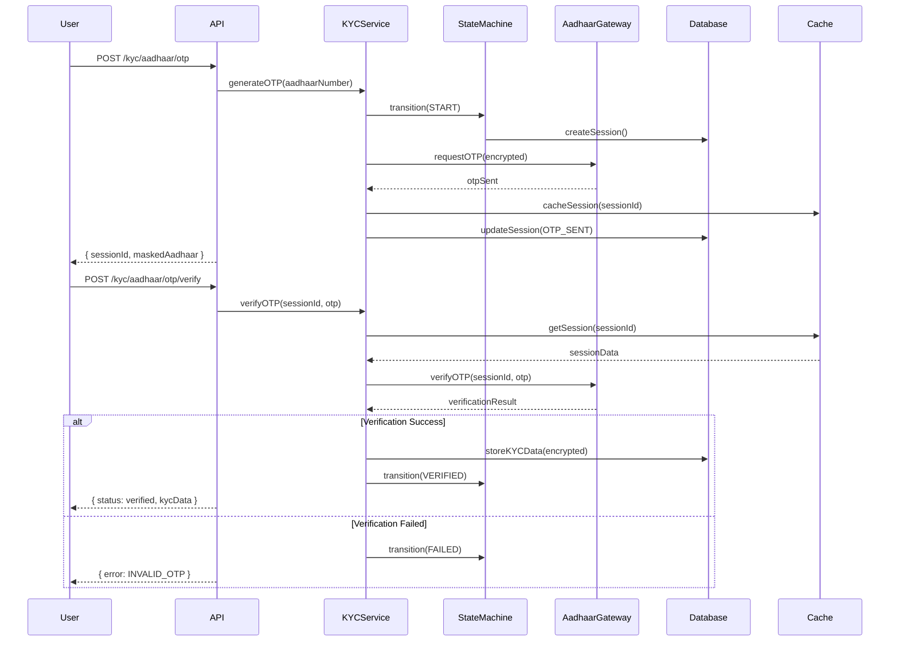

# KYC/Aadhaar Validation Architecture Design Document

## Executive Summary

This document outlines the comprehensive architecture for implementing KYC/Aadhaar validation APIs within the auth-service ecosystem. The design follows functional programming principles, maintains zero storage dependencies at the library level, and ensures secure handling of sensitive Aadhaar data in compliance with UIDAI regulations and data protection laws.

## Table of Contents

1. [Architecture Overview](#architecture-overview)
2. [API Endpoints Specification](#api-endpoints-specification)
3. [Service Layer Architecture](#service-layer-architecture)
4. [Data Models and Schema](#data-models-and-schema)
5. [External Integration Patterns](#external-integration-patterns)
6. [Security Architecture](#security-architecture)
7. [Error Handling Strategy](#error-handling-strategy)
8. [Rate Limiting and Throttling](#rate-limiting-and-throttling)
9. [Caching Strategy](#caching-strategy)
10. [Business Logic Flow](#business-logic-flow)
11. [Compliance and Regulatory Considerations](#compliance-and-regulatory-considerations)
12. [Implementation Roadmap](#implementation-roadmap)

---

## Architecture Overview

### Design Principles

1. **Functional Programming**: Pure functions with no side effects
2. **Zero Storage Coupling**: No direct storage dependencies at library level
3. **Security First**: End-to-end encryption for PII data
4. **Compliance Driven**: UIDAI and GDPR/DPDP Act compliant
5. **Resilient Design**: Circuit breakers and graceful degradation
6. **Observable**: Comprehensive telemetry and audit logging

### High-Level Architecture

```
┌─────────────────────────────────────────────────────────────────┐
│                    Client Application Layer                      │
│  (React/React Native/Node.js Consumer)                          │
└─────────────────────────────────┬───────────────────────────────┘
                                  │
                                  │ HTTPS/TLS 1.3
                                  ▼
┌─────────────────────────────────────────────────────────────────┐
│                    API Gateway Layer                             │
│  - Rate Limiting                                                 │
│  - Request Validation                                            │
│  - API Key Management                                            │
│  - Request/Response Encryption                                   │
└─────────────────────────────────┬───────────────────────────────┘
                                  │
                                  ▼
┌─────────────────────────────────────────────────────────────────┐
│                  KYC Service Layer (New)                         │
│ ┌──────────────────┐ ┌──────────────────┐ ┌──────────────────┐│
│ │ OTP Generation    │ │ OTP Verification │ │ Status Service   ││
│ │    Service        │ │    Service       │ │                  ││
│ └──────────────────┘ └──────────────────┘ └──────────────────┘│
│ ┌──────────────────────────────────────────────────────────┐  │
│ │              KYC Orchestration Service                     │  │
│ │  - Workflow Management                                     │  │
│ │  - State Machine Implementation                            │  │
│ │  - Audit Trail Management                                  │  │
│ └──────────────────────────────────────────────────────────┘  │
└─────────────────────────────────┬───────────────────────────────┘
                                  │
                    ┌─────────────┼─────────────┐
                    │             │             │
                    ▼             ▼             ▼
┌──────────────────────┐ ┌──────────────┐ ┌──────────────────────┐
│ Aadhaar Gateway      │ │ Cache Layer  │ │ Database Layer       │
│ (External Service)   │ │ (Redis)      │ │ (PostgreSQL)         │
│ - UIDAI API          │ │              │ │ - KYC Records        │
│ - DigiLocker API     │ │ - OTP Cache  │ │ - Audit Logs         │
│ - Third-party KYC    │ │ - Rate Limit │ │ - User KYC Status    │
└──────────────────────┘ └──────────────┘ └──────────────────────┘
```

---

## API Endpoints Specification

### 1. Generate OTP for Aadhaar Verification

```yaml
POST /api/v1/kyc/aadhaar/otp
Content-Type: application/json
Authorization: Bearer {access_token}

Request:
{
  "aadhaar_number": "string", # Masked format: XXXX-XXXX-1234
  "consent": {
    "purpose": "string",
    "timestamp": "ISO8601",
    "version": "string"
  },
  "request_id": "uuid" # Idempotency key
}

Response 200:
{
  "session_id": "uuid",
  "masked_aadhaar": "XXXX-XXXX-1234",
  "otp_sent_to": "******7890",
  "expires_at": "ISO8601",
  "attempts_remaining": 3,
  "request_id": "uuid"
}

Response 400/422:
{
  "error": {
    "code": "INVALID_AADHAAR",
    "message": "Invalid Aadhaar number format",
    "details": {}
  }
}

Response 429:
{
  "error": {
    "code": "RATE_LIMIT_EXCEEDED",
    "message": "Too many OTP requests",
    "retry_after": 300
  }
}
```

### 2. Verify Aadhaar OTP

```yaml
POST /api/v1/kyc/aadhaar/otp/verify
Content-Type: application/json
Authorization: Bearer {access_token}

Request:
{
  "session_id": "uuid",
  "otp": "string", # 6-digit OTP
  "share_code": "string" # Optional: 4-digit share code for eKYC
}

Response 200:
{
  "verification_id": "uuid",
  "status": "verified",
  "kyc_data": {
    "reference_id": "string", # UIDAI reference
    "name": "string",
    "dob": "YYYY-MM-DD",
    "gender": "M/F/O",
    "address": {
      "house": "string",
      "street": "string",
      "landmark": "string",
      "locality": "string",
      "vtc": "string",
      "district": "string",
      "state": "string",
      "pincode": "string"
    },
    "photo": "base64_encoded" # If share_code provided
  },
  "verified_at": "ISO8601"
}

Response 400:
{
  "error": {
    "code": "INVALID_OTP",
    "message": "Invalid or expired OTP",
    "attempts_remaining": 2
  }
}
```

### 3. Get KYC Verification Status

```yaml
GET /api/v1/kyc/status/{user_id}
Authorization: Bearer {access_token}

Response 200:
{
  "user_id": "uuid",
  "kyc_status": "not_initiated|in_progress|verified|failed|expired",
  "verification_levels": {
    "aadhaar": {
      "status": "verified|pending|not_initiated",
      "verified_at": "ISO8601",
      "expires_at": "ISO8601"
    },
    "pan": {
      "status": "verified|pending|not_initiated",
      "verified_at": "ISO8601"
    },
    "bank_account": {
      "status": "verified|pending|not_initiated",
      "verified_at": "ISO8601"
    }
  },
  "next_action": "string",
  "last_updated": "ISO8601"
}
```

---

## Service Layer Architecture

### Functional Service Design

```typescript
// services/kycService.ts
import { ApiClient } from '../utils/apiClient';
import {
  AadhaarOTPRequest,
  AadhaarOTPResponse,
  AadhaarVerifyRequest,
  AadhaarVerifyResponse,
  KYCStatus
} from '../types/kyc';

export const createKYCService = (apiClient: ApiClient) => ({
  aadhaar: {
    generateOTP: (request: AadhaarOTPRequest): Promise<AadhaarOTPResponse> =>
      apiClient.post('/api/v1/kyc/aadhaar/otp', request),

    verifyOTP: (request: AadhaarVerifyRequest): Promise<AadhaarVerifyResponse> =>
      apiClient.post('/api/v1/kyc/aadhaar/otp/verify', request),
  },

  status: {
    get: (userId: string): Promise<KYCStatus> =>
      apiClient.get(`/api/v1/kyc/status/${userId}`),
  }
});
```

### Service Layer Components

1. **KYC Orchestration Service**
   - Manages KYC workflow state machine
   - Coordinates between multiple verification methods
   - Handles retry logic and circuit breaking

2. **Aadhaar Integration Service**
   - Abstracts UIDAI API complexity
   - Handles encryption/decryption
   - Manages session lifecycle

3. **Audit Service**
   - Records all KYC attempts
   - Maintains compliance logs
   - Generates audit reports

4. **Notification Service**
   - Sends OTP via SMS gateway
   - Manages notification templates
   - Handles delivery status

---

## Data Models and Schema

### Database Schema (PostgreSQL)

```sql
-- KYC Sessions Table
CREATE TABLE kyc_sessions (
  id UUID PRIMARY KEY DEFAULT gen_random_uuid(),
  user_id UUID NOT NULL REFERENCES users(id),
  session_type VARCHAR(50) NOT NULL, -- 'aadhaar', 'pan', 'bank'
  session_status VARCHAR(50) NOT NULL, -- 'initiated', 'otp_sent', 'verified', 'failed', 'expired'
  masked_identifier VARCHAR(255), -- Masked Aadhaar/PAN
  created_at TIMESTAMP WITH TIME ZONE DEFAULT CURRENT_TIMESTAMP,
  expires_at TIMESTAMP WITH TIME ZONE NOT NULL,
  attempts INTEGER DEFAULT 0,
  max_attempts INTEGER DEFAULT 3,
  metadata JSONB,

  INDEX idx_user_sessions (user_id, session_type),
  INDEX idx_session_status (session_status, expires_at)
);

-- KYC Verifications Table
CREATE TABLE kyc_verifications (
  id UUID PRIMARY KEY DEFAULT gen_random_uuid(),
  user_id UUID NOT NULL REFERENCES users(id),
  session_id UUID REFERENCES kyc_sessions(id),
  verification_type VARCHAR(50) NOT NULL,
  verification_status VARCHAR(50) NOT NULL,
  reference_id VARCHAR(255), -- UIDAI reference
  encrypted_data BYTEA, -- Encrypted KYC data
  data_hash VARCHAR(64), -- SHA-256 hash for integrity
  verified_at TIMESTAMP WITH TIME ZONE,
  expires_at TIMESTAMP WITH TIME ZONE,
  created_at TIMESTAMP WITH TIME ZONE DEFAULT CURRENT_TIMESTAMP,
  updated_at TIMESTAMP WITH TIME ZONE DEFAULT CURRENT_TIMESTAMP,

  UNIQUE(user_id, verification_type),
  INDEX idx_verification_status (verification_status, expires_at)
);

-- KYC Audit Log Table
CREATE TABLE kyc_audit_logs (
  id UUID PRIMARY KEY DEFAULT gen_random_uuid(),
  user_id UUID NOT NULL,
  session_id UUID,
  action VARCHAR(100) NOT NULL,
  action_status VARCHAR(50) NOT NULL,
  ip_address INET,
  user_agent TEXT,
  request_data JSONB,
  response_data JSONB,
  error_details JSONB,
  created_at TIMESTAMP WITH TIME ZONE DEFAULT CURRENT_TIMESTAMP,

  INDEX idx_audit_user (user_id, created_at),
  INDEX idx_audit_action (action, created_at)
);

-- Rate Limiting Table
CREATE TABLE kyc_rate_limits (
  id UUID PRIMARY KEY DEFAULT gen_random_uuid(),
  identifier VARCHAR(255) NOT NULL, -- user_id or IP
  action VARCHAR(100) NOT NULL,
  count INTEGER DEFAULT 1,
  window_start TIMESTAMP WITH TIME ZONE DEFAULT CURRENT_TIMESTAMP,
  window_end TIMESTAMP WITH TIME ZONE,

  UNIQUE(identifier, action, window_start),
  INDEX idx_rate_limit_window (identifier, action, window_end)
);
```

### TypeScript Type Definitions

```typescript
// types/kyc.ts

export interface AadhaarOTPRequest {
  aadhaar_number: string;
  consent: {
    purpose: string;
    timestamp: string;
    version: string;
  };
  request_id?: string;
}

export interface AadhaarOTPResponse {
  session_id: string;
  masked_aadhaar: string;
  otp_sent_to: string;
  expires_at: string;
  attempts_remaining: number;
  request_id: string;
}

export interface AadhaarVerifyRequest {
  session_id: string;
  otp: string;
  share_code?: string;
}

export interface AadhaarVerifyResponse {
  verification_id: string;
  status: 'verified' | 'failed';
  kyc_data?: {
    reference_id: string;
    name: string;
    dob: string;
    gender: 'M' | 'F' | 'O';
    address: AadhaarAddress;
    photo?: string;
  };
  verified_at: string;
}

export interface AadhaarAddress {
  house: string;
  street: string;
  landmark: string;
  locality: string;
  vtc: string;
  district: string;
  state: string;
  pincode: string;
}

export interface KYCStatus {
  user_id: string;
  kyc_status: 'not_initiated' | 'in_progress' | 'verified' | 'failed' | 'expired';
  verification_levels: {
    [key: string]: {
      status: string;
      verified_at?: string;
      expires_at?: string;
    };
  };
  next_action?: string;
  last_updated: string;
}
```

---

## External Integration Patterns

### Aadhaar Gateway Integration

```typescript
// integrations/aadhaarGateway.ts

interface AadhaarGatewayConfig {
  baseURL: string;
  apiKey: string;
  licenseKey: string;
  encryptionKey: string;
  timeout: number;
  retryConfig: {
    maxRetries: number;
    backoffMultiplier: number;
  };
}

class AadhaarGateway {
  private circuitBreaker: CircuitBreaker;
  private encryptionService: EncryptionService;

  constructor(private config: AadhaarGatewayConfig) {
    this.circuitBreaker = new CircuitBreaker({
      failureThreshold: 5,
      resetTimeout: 60000,
      monitoringPeriod: 120000
    });

    this.encryptionService = new EncryptionService(config.encryptionKey);
  }

  async generateOTP(aadhaarNumber: string): Promise<UIDAPIResponse> {
    return this.circuitBreaker.execute(async () => {
      const encryptedAadhaar = await this.encryptionService.encrypt(aadhaarNumber);

      const request = {
        uid: encryptedAadhaar,
        txnId: generateTransactionId(),
        licenseKey: this.config.licenseKey,
        consent: 'Y',
        timestamp: new Date().toISOString()
      };

      const signature = await this.signRequest(request);

      return this.httpClient.post('/otp/generate', {
        ...request,
        signature
      });
    });
  }

  async verifyOTP(sessionId: string, otp: string): Promise<UIDAPIVerifyResponse> {
    return this.circuitBreaker.execute(async () => {
      const encryptedOTP = await this.encryptionService.encrypt(otp);

      return this.httpClient.post('/otp/verify', {
        sessionId,
        otp: encryptedOTP,
        txnId: generateTransactionId()
      });
    });
  }

  private async signRequest(data: any): Promise<string> {
    // Implement PKCS#7 signature as per UIDAI specification
    return generatePKCS7Signature(data, this.config.certificatePath);
  }
}
```

### Circuit Breaker Pattern

```typescript
class CircuitBreaker {
  private state: 'CLOSED' | 'OPEN' | 'HALF_OPEN' = 'CLOSED';
  private failureCount = 0;
  private lastFailureTime?: Date;
  private successCount = 0;

  async execute<T>(operation: () => Promise<T>): Promise<T> {
    if (this.state === 'OPEN') {
      if (this.shouldAttemptReset()) {
        this.state = 'HALF_OPEN';
      } else {
        throw new CircuitBreakerOpenError('Circuit breaker is open');
      }
    }

    try {
      const result = await operation();
      this.onSuccess();
      return result;
    } catch (error) {
      this.onFailure();
      throw error;
    }
  }

  private onSuccess(): void {
    this.failureCount = 0;
    if (this.state === 'HALF_OPEN') {
      this.successCount++;
      if (this.successCount >= this.config.successThreshold) {
        this.state = 'CLOSED';
        this.successCount = 0;
      }
    }
  }

  private onFailure(): void {
    this.failureCount++;
    this.lastFailureTime = new Date();

    if (this.failureCount >= this.config.failureThreshold) {
      this.state = 'OPEN';
      this.successCount = 0;
    }
  }
}
```

---

## Security Architecture

### 1. Data Encryption Strategy

```typescript
// security/encryptionService.ts

class KYCEncryptionService {
  private masterKey: Buffer;
  private dataEncryptionKeys: Map<string, Buffer> = new Map();

  constructor(private kmsClient: KMSClient) {
    this.masterKey = this.kmsClient.getMasterKey();
  }

  // Field-level encryption for PII
  async encryptPII(data: any): Promise<EncryptedData> {
    const dek = await this.generateDataEncryptionKey();

    const encryptedFields = {
      aadhaar: await this.encryptField(data.aadhaar, dek),
      name: await this.encryptField(data.name, dek),
      dob: await this.encryptField(data.dob, dek),
      address: await this.encryptField(JSON.stringify(data.address), dek)
    };

    const encryptedDEK = await this.kmsClient.encrypt(dek);

    return {
      data: encryptedFields,
      keyId: encryptedDEK.keyId,
      algorithm: 'AES-256-GCM'
    };
  }

  // Tokenization for Aadhaar numbers
  async tokenizeAadhaar(aadhaar: string): Promise<string> {
    const hash = crypto.createHash('sha256')
      .update(aadhaar + this.config.salt)
      .digest('hex');

    await this.storeTokenMapping(hash, aadhaar);
    return hash;
  }
}
```

### 2. Authentication & Authorization

```yaml
Security Layers:
  1. API Gateway:
     - API Key validation
     - Rate limiting per API key
     - Request signing verification

  2. Application Layer:
     - JWT token validation
     - Role-based access control
     - Resource-level permissions

  3. Service Layer:
     - Service-to-service authentication (mTLS)
     - Internal API keys
     - Request context propagation
```

### 3. Audit & Compliance

```typescript
// audit/auditService.ts

class KYCAuditService {
  async logKYCAction(action: KYCAction): Promise<void> {
    const auditEntry = {
      id: generateUUID(),
      timestamp: new Date().toISOString(),
      userId: action.userId,
      action: action.type,
      metadata: {
        ip: action.ipAddress,
        userAgent: action.userAgent,
        sessionId: action.sessionId
      },
      result: action.result,
      dataAccessed: this.sanitizeDataAccessed(action.dataAccessed)
    };

    // Write to immutable audit log
    await this.auditStore.write(auditEntry);

    // Send to SIEM if configured
    if (this.siemClient) {
      await this.siemClient.send(auditEntry);
    }
  }

  private sanitizeDataAccessed(data: any): any {
    // Remove PII from audit logs
    return {
      fields: Object.keys(data),
      hasAadhaar: !!data.aadhaar,
      hasAddress: !!data.address
    };
  }
}
```

### 4. Security Headers & Policies

```typescript
// middleware/security.ts

export const securityMiddleware = {
  helmet: {
    contentSecurityPolicy: {
      directives: {
        defaultSrc: ["'self'"],
        scriptSrc: ["'self'", "'unsafe-inline'"],
        styleSrc: ["'self'", "'unsafe-inline'"],
        imgSrc: ["'self'", "data:", "https:"],
        connectSrc: ["'self'"],
        fontSrc: ["'self'"],
        objectSrc: ["'none'"],
        mediaSrc: ["'self'"],
        frameSrc: ["'none'"],
      },
    },
    hsts: {
      maxAge: 31536000,
      includeSubDomains: true,
      preload: true
    }
  },

  cors: {
    origin: process.env.ALLOWED_ORIGINS?.split(',') || false,
    credentials: true,
    maxAge: 86400
  },

  rateLimit: {
    windowMs: 15 * 60 * 1000, // 15 minutes
    max: 100,
    message: 'Too many requests from this IP'
  }
};
```

---

## Error Handling Strategy

### Error Classification

```typescript
// errors/kycErrors.ts

export enum KYCErrorCode {
  // Client Errors (4xx)
  INVALID_AADHAAR = 'KYC_400_001',
  INVALID_OTP = 'KYC_400_002',
  SESSION_EXPIRED = 'KYC_400_003',
  CONSENT_REQUIRED = 'KYC_400_004',
  INVALID_REQUEST = 'KYC_400_005',

  // Rate Limiting
  RATE_LIMIT_EXCEEDED = 'KYC_429_001',

  // Server Errors (5xx)
  AADHAAR_SERVICE_UNAVAILABLE = 'KYC_503_001',
  DATABASE_ERROR = 'KYC_500_001',
  ENCRYPTION_ERROR = 'KYC_500_002',

  // Business Logic Errors
  MAX_ATTEMPTS_EXCEEDED = 'KYC_BL_001',
  VERIFICATION_FAILED = 'KYC_BL_002',
  DUPLICATE_VERIFICATION = 'KYC_BL_003'
}

export class KYCError extends Error {
  constructor(
    public code: KYCErrorCode,
    public message: string,
    public statusCode: number,
    public details?: any
  ) {
    super(message);
    this.name = 'KYCError';
  }

  toJSON() {
    return {
      error: {
        code: this.code,
        message: this.message,
        details: this.details
      }
    };
  }
}
```

### Error Handler Middleware

```typescript
// middleware/errorHandler.ts

export const kycErrorHandler = (
  error: Error,
  req: Request,
  res: Response,
  next: NextFunction
) => {
  // Log error with context
  logger.error('KYC Error', {
    error: error.message,
    stack: error.stack,
    requestId: req.id,
    userId: req.user?.id,
    path: req.path,
    method: req.method
  });

  // Audit failed attempts
  if (error instanceof KYCError) {
    auditService.logKYCAction({
      type: 'KYC_ERROR',
      userId: req.user?.id,
      result: 'FAILED',
      error: error.code,
      ipAddress: req.ip,
      userAgent: req.get('user-agent')
    });

    return res.status(error.statusCode).json(error.toJSON());
  }

  // Handle gateway errors with circuit breaker
  if (error instanceof GatewayError) {
    circuitBreaker.recordFailure();
    return res.status(503).json({
      error: {
        code: 'SERVICE_UNAVAILABLE',
        message: 'KYC service is temporarily unavailable',
        retry_after: 300
      }
    });
  }

  // Default error response
  res.status(500).json({
    error: {
      code: 'INTERNAL_ERROR',
      message: 'An internal error occurred'
    }
  });
};
```

---

## Rate Limiting and Throttling

### Multi-Level Rate Limiting

```typescript
// middleware/rateLimiter.ts

export const createRateLimiters = () => ({
  // Global rate limit per IP
  global: rateLimit({
    windowMs: 15 * 60 * 1000,
    max: 1000,
    keyGenerator: (req) => req.ip,
    handler: (req, res) => {
      res.status(429).json({
        error: {
          code: 'GLOBAL_RATE_LIMIT',
          message: 'Too many requests',
          retry_after: 900
        }
      });
    }
  }),

  // OTP generation rate limit
  otpGeneration: rateLimit({
    windowMs: 60 * 60 * 1000, // 1 hour
    max: 3, // 3 OTP requests per hour
    keyGenerator: (req) => `${req.user.id}_otp`,
    skipSuccessfulRequests: false,
    handler: async (req, res) => {
      await auditService.logRateLimit({
        userId: req.user.id,
        action: 'OTP_GENERATION',
        blocked: true
      });

      res.status(429).json({
        error: {
          code: 'OTP_RATE_LIMIT',
          message: 'Maximum OTP requests exceeded',
          retry_after: 3600
        }
      });
    }
  }),

  // OTP verification rate limit
  otpVerification: rateLimit({
    windowMs: 15 * 60 * 1000,
    max: 5, // 5 attempts per 15 minutes
    keyGenerator: (req) => req.body.session_id,
    skipSuccessfulRequests: true
  }),

  // KYC status check rate limit
  statusCheck: rateLimit({
    windowMs: 60 * 1000,
    max: 10, // 10 requests per minute
    keyGenerator: (req) => req.user.id
  })
});
```

### Distributed Rate Limiting with Redis

```typescript
// utils/distributedRateLimiter.ts

class DistributedRateLimiter {
  constructor(private redis: Redis) {}

  async checkLimit(
    key: string,
    limit: number,
    window: number
  ): Promise<RateLimitResult> {
    const multi = this.redis.multi();
    const now = Date.now();
    const windowStart = now - window;

    // Remove old entries
    multi.zremrangebyscore(key, 0, windowStart);

    // Add current request
    multi.zadd(key, now, `${now}_${Math.random()}`);

    // Count requests in window
    multi.zcard(key);

    // Set expiry
    multi.expire(key, Math.ceil(window / 1000));

    const results = await multi.exec();
    const count = results[2][1] as number;

    return {
      allowed: count <= limit,
      remaining: Math.max(0, limit - count),
      resetAt: new Date(now + window)
    };
  }
}
```

---

## Caching Strategy

### Multi-Tier Caching

```typescript
// cache/cacheStrategy.ts

export class KYCCacheStrategy {
  private l1Cache: NodeCache; // In-memory cache
  private l2Cache: Redis;      // Distributed cache

  constructor(config: CacheConfig) {
    this.l1Cache = new NodeCache({
      stdTTL: 300, // 5 minutes
      checkperiod: 60
    });

    this.l2Cache = new Redis(config.redis);
  }

  // Cache OTP sessions
  async cacheOTPSession(
    sessionId: string,
    data: OTPSession,
    ttl: number = 600 // 10 minutes
  ): Promise<void> {
    const key = `otp_session:${sessionId}`;

    // L1 cache
    this.l1Cache.set(key, data, ttl);

    // L2 cache with encryption
    const encrypted = await this.encrypt(data);
    await this.l2Cache.setex(key, ttl, JSON.stringify(encrypted));
  }

  // Cache KYC verification results
  async cacheVerification(
    userId: string,
    verification: KYCVerification,
    ttl: number = 86400 // 24 hours
  ): Promise<void> {
    const key = `kyc_verification:${userId}`;

    // Only cache non-sensitive data
    const cacheable = {
      status: verification.status,
      verifiedAt: verification.verifiedAt,
      expiresAt: verification.expiresAt,
      verificationId: verification.id
    };

    this.l1Cache.set(key, cacheable, ttl);
    await this.l2Cache.setex(key, ttl, JSON.stringify(cacheable));
  }

  // Cache invalidation
  async invalidate(pattern: string): Promise<void> {
    // Clear L1 cache
    const l1Keys = this.l1Cache.keys();
    l1Keys.forEach(key => {
      if (key.includes(pattern)) {
        this.l1Cache.del(key);
      }
    });

    // Clear L2 cache
    const l2Keys = await this.l2Cache.keys(pattern + '*');
    if (l2Keys.length > 0) {
      await this.l2Cache.del(...l2Keys);
    }
  }
}
```

### Cache-Aside Pattern

```typescript
// services/kycServiceWithCache.ts

class KYCServiceWithCache {
  async getKYCStatus(userId: string): Promise<KYCStatus> {
    const cacheKey = `kyc_status:${userId}`;

    // Try L1 cache
    const l1Result = this.cache.l1Get(cacheKey);
    if (l1Result) {
      metrics.increment('cache.hit.l1');
      return l1Result;
    }

    // Try L2 cache
    const l2Result = await this.cache.l2Get(cacheKey);
    if (l2Result) {
      metrics.increment('cache.hit.l2');
      this.cache.l1Set(cacheKey, l2Result, 300);
      return l2Result;
    }

    // Cache miss - fetch from database
    metrics.increment('cache.miss');
    const status = await this.database.getKYCStatus(userId);

    // Write-through cache
    await this.cache.l2Set(cacheKey, status, 3600);
    this.cache.l1Set(cacheKey, status, 300);

    return status;
  }
}
```

---

## Business Logic Flow

### KYC Verification State Machine

```typescript
// stateMachine/kycStateMachine.ts

export enum KYCState {
  NOT_INITIATED = 'NOT_INITIATED',
  CONSENT_PENDING = 'CONSENT_PENDING',
  OTP_GENERATION_PENDING = 'OTP_GENERATION_PENDING',
  OTP_SENT = 'OTP_SENT',
  OTP_VERIFICATION_PENDING = 'OTP_VERIFICATION_PENDING',
  VERIFIED = 'VERIFIED',
  FAILED = 'FAILED',
  EXPIRED = 'EXPIRED'
}

export enum KYCEvent {
  START = 'START',
  CONSENT_PROVIDED = 'CONSENT_PROVIDED',
  GENERATE_OTP = 'GENERATE_OTP',
  OTP_SENT_SUCCESS = 'OTP_SENT_SUCCESS',
  OTP_SENT_FAILED = 'OTP_SENT_FAILED',
  VERIFY_OTP = 'VERIFY_OTP',
  VERIFICATION_SUCCESS = 'VERIFICATION_SUCCESS',
  VERIFICATION_FAILED = 'VERIFICATION_FAILED',
  SESSION_EXPIRED = 'SESSION_EXPIRED',
  MAX_ATTEMPTS_REACHED = 'MAX_ATTEMPTS_REACHED'
}

class KYCStateMachine {
  private transitions = {
    [KYCState.NOT_INITIATED]: {
      [KYCEvent.START]: KYCState.CONSENT_PENDING
    },
    [KYCState.CONSENT_PENDING]: {
      [KYCEvent.CONSENT_PROVIDED]: KYCState.OTP_GENERATION_PENDING
    },
    [KYCState.OTP_GENERATION_PENDING]: {
      [KYCEvent.GENERATE_OTP]: KYCState.OTP_SENT,
      [KYCEvent.OTP_SENT_FAILED]: KYCState.FAILED
    },
    [KYCState.OTP_SENT]: {
      [KYCEvent.VERIFY_OTP]: KYCState.OTP_VERIFICATION_PENDING,
      [KYCEvent.SESSION_EXPIRED]: KYCState.EXPIRED,
      [KYCEvent.MAX_ATTEMPTS_REACHED]: KYCState.FAILED
    },
    [KYCState.OTP_VERIFICATION_PENDING]: {
      [KYCEvent.VERIFICATION_SUCCESS]: KYCState.VERIFIED,
      [KYCEvent.VERIFICATION_FAILED]: KYCState.OTP_SENT,
      [KYCEvent.MAX_ATTEMPTS_REACHED]: KYCState.FAILED
    }
  };

  async transition(
    currentState: KYCState,
    event: KYCEvent,
    context: KYCContext
  ): Promise<KYCState> {
    const nextState = this.transitions[currentState]?.[event];

    if (!nextState) {
      throw new Error(`Invalid transition: ${currentState} + ${event}`);
    }

    // Execute side effects
    await this.executeSideEffects(currentState, nextState, event, context);

    // Audit state transition
    await this.auditService.logStateTransition({
      sessionId: context.sessionId,
      fromState: currentState,
      toState: nextState,
      event: event,
      timestamp: new Date()
    });

    return nextState;
  }

  private async executeSideEffects(
    from: KYCState,
    to: KYCState,
    event: KYCEvent,
    context: KYCContext
  ): Promise<void> {
    switch (to) {
      case KYCState.OTP_SENT:
        await this.notificationService.sendOTPNotification(context.userId);
        break;

      case KYCState.VERIFIED:
        await this.kycService.storeVerificationData(context);
        await this.notificationService.sendVerificationSuccess(context.userId);
        break;

      case KYCState.FAILED:
        await this.notificationService.sendVerificationFailed(context.userId);
        await this.kycService.lockAccount(context.userId, 24 * 60 * 60);
        break;
    }
  }
}
```

### Business Logic Flow Diagram



---

## Compliance and Regulatory Considerations

### UIDAI Compliance Requirements

1. **Data Minimization**
   - Only collect required Aadhaar data
   - No storage of Aadhaar number in plain text
   - Implement data purging policies

2. **Consent Management**
   - Explicit consent before each verification
   - Consent versioning and audit trail
   - Purpose limitation enforcement

3. **Security Standards**
   - ISO 27001 compliance
   - End-to-end encryption
   - Regular security audits

4. **Audit Requirements**
   - Maintain 7-year audit trail
   - Real-time monitoring
   - Quarterly compliance reports

### GDPR/DPDP Act Compliance

```typescript
// compliance/dataProtection.ts

export class DataProtectionCompliance {
  // Right to be forgotten
  async deleteUserKYCData(userId: string): Promise<void> {
    // Soft delete with anonymization
    await this.database.transaction(async trx => {
      // Anonymize PII data
      await trx('kyc_verifications')
        .where({ user_id: userId })
        .update({
          encrypted_data: null,
          reference_id: crypto.randomBytes(16).toString('hex'),
          deleted_at: new Date()
        });

      // Retain audit logs with anonymized user reference
      await trx('kyc_audit_logs')
        .where({ user_id: userId })
        .update({
          user_id: hashUserId(userId),
          anonymized: true
        });
    });

    // Clear all caches
    await this.cache.invalidate(`*${userId}*`);
  }

  // Data portability
  async exportUserKYCData(userId: string): Promise<UserDataExport> {
    const data = await this.database.getUserKYCData(userId);

    return {
      format: 'JSON',
      version: '1.0',
      exportedAt: new Date().toISOString(),
      data: this.sanitizeForExport(data)
    };
  }
}
```

---

## Implementation Roadmap

### Phase 1: Foundation (Week 1-2)
- Set up project structure
- Implement basic type definitions
- Create database schema
- Set up encryption service
- Implement audit logging

### Phase 2: Core Services (Week 3-4)
- Develop KYC service layer
- Implement state machine
- Create Aadhaar gateway integration
- Add circuit breaker pattern
- Implement caching layer

### Phase 3: Security & Compliance (Week 5-6)
- Implement field-level encryption
- Add rate limiting
- Set up audit trail
- Implement consent management
- Add data protection features

### Phase 4: Testing & Hardening (Week 7-8)
- Unit tests (>90% coverage)
- Integration tests
- Security testing
- Performance testing
- Compliance validation

### Phase 5: Documentation & Deployment (Week 9-10)
- API documentation
- Security documentation
- Deployment guides
- Monitoring setup
- Production readiness review

---

## Monitoring & Observability

### Key Metrics

```typescript
// monitoring/metrics.ts

export const KYCMetrics = {
  // Business Metrics
  otpGenerationRate: new Counter({
    name: 'kyc_otp_generation_total',
    help: 'Total OTP generation requests',
    labelNames: ['status', 'provider']
  }),

  verificationRate: new Counter({
    name: 'kyc_verification_total',
    help: 'Total KYC verifications',
    labelNames: ['status', 'type', 'provider']
  }),

  verificationDuration: new Histogram({
    name: 'kyc_verification_duration_seconds',
    help: 'KYC verification duration',
    labelNames: ['type'],
    buckets: [0.1, 0.5, 1, 2, 5, 10]
  }),

  // Technical Metrics
  gatewayLatency: new Histogram({
    name: 'aadhaar_gateway_latency_seconds',
    help: 'Aadhaar gateway response time',
    labelNames: ['operation'],
    buckets: [0.1, 0.25, 0.5, 1, 2.5, 5, 10]
  }),

  circuitBreakerState: new Gauge({
    name: 'circuit_breaker_state',
    help: 'Circuit breaker state (0=closed, 1=open, 2=half-open)',
    labelNames: ['service']
  }),

  cacheHitRate: new Counter({
    name: 'cache_hits_total',
    help: 'Cache hit rate',
    labelNames: ['cache_level', 'operation']
  })
};
```

### Alerts Configuration

```yaml
alerts:
  - name: HighOTPFailureRate
    expr: rate(kyc_otp_generation_total{status="failed"}[5m]) > 0.1
    for: 5m
    annotations:
      summary: "High OTP generation failure rate"

  - name: AadhaarGatewayDown
    expr: circuit_breaker_state{service="aadhaar_gateway"} == 1
    for: 1m
    annotations:
      summary: "Aadhaar gateway circuit breaker open"

  - name: HighVerificationLatency
    expr: histogram_quantile(0.95, kyc_verification_duration_seconds) > 5
    for: 10m
    annotations:
      summary: "High KYC verification latency"
```

---

## Conclusion

This architecture provides a robust, secure, and compliant foundation for KYC/Aadhaar validation services. Key strengths include:

1. **Security-first design** with multiple layers of protection
2. **Scalable architecture** with caching and circuit breakers
3. **Compliance-ready** with audit trails and data protection
4. **Observable system** with comprehensive monitoring
5. **Maintainable code** following functional programming principles

The design ensures that sensitive Aadhaar data is handled securely while providing a seamless verification experience for users.